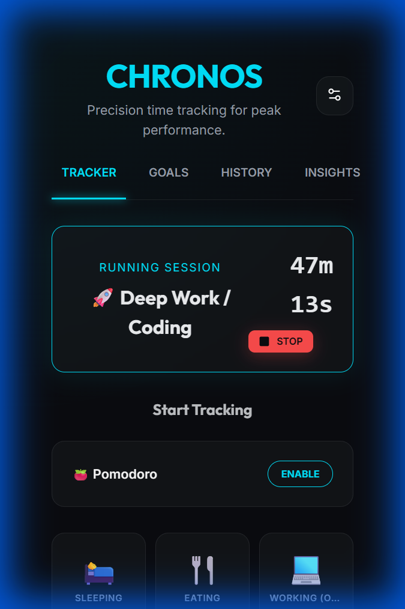

#  Chronos Tracker

**Precision time tracking for peak performance.**

Chronos Tracker is a sophisticated, glassmorphic productivity suite designed for deep work and multi-dimensional analysis. Built as a high-performance Progressive Web App (PWA), it offers a seamless experience across desktop and mobile.

---

[***Download***](/Chronos-tracker/release)

Ver.1.3 
Fixed local storage error

## ✨ Key Features

### 🚀 Advanced Tracking
- **Multi-Timer Support**: Track multiple activities simultaneously without losing a second.
- **Pomodoro Focus Mode**: Integrated work/break cycles (25m/5m) with automatic tracking pauses.
- **Precision Logging**: Real-time timer synchronization and detailed history management.

### 🎯 Goal Management
- **Daily Target Setting**: Set custom minute-based goals for every activity.
- **Visual Progress**: Real-time progress bars in the **GOALS** tab showing "Actual vs Target" performance.
- **Time Refinement**: Automatically formats long durations into readable `h m` segments (e.g., 1h 30m).

### 📈 Insights & Analytics
- **Efficiency Trends**: Compare today's focus against your historical daily averages.
- **Weekly Heatmap**: A visual intensity grid showing your productivity levels over the last 7 days.
- **Export Power**: One-click **CSV Export** for professional data analysis in Excel or Google Sheets.

### 📱 Premium PWA & Native Ready
- **Installable**: One-tap installation on iOS and Android for a native-like experience.
- **Offline First**: All data is saved on-device using local storage—track your time anywhere.
- **Native Bridge**: Pre-configured with **Capacitor**, ready to be built for the Apple App Store and Google Play Store.

---

## 🎨 Showcase

<div align="center">
  
  <br />
  <div style="display: flex; gap: 10px; justify-content: center;">
    
    
    
  </div>
  <br />
  
</div>

---

## 📥 Download APK
Want to try it on your Android device?
[**Download Chronos Tracker (Debug APK)**](release/chronos-tracker-debug.apk)

---

## 🛠️ Tech Stack

- **Core**: React + Vite + TypeScript
- **Styling**: Vanilla CSS (Electric Blue Glassmorphism)
- **Icons**: Lucide React
- **Analytics**: Recharts
- **PWA**: Vite PWA Plugin
- **Native**: Capacitor JS

---

## 🚀 Getting Started

### Local Development
1. Clone the repo
2. Run `npm install`
3. Start the dev server: `npm run dev`

### Installation (PWA)
1. Open the app URL on your phone's browser.
2. Tap **'Share'** (iOS) or the **Menu (⋮)** (Android).
3. Select **'Add to Home Screen'**.

### Mobile Stores (Native)
The project includes `android/` and `ios/` folders. 
- **Android**: Open the `android` folder in Android Studio.
- **iOS**: Open the `ios` folder in Xcode (macOS only).

---

## 📦 Production Build
To generate the production-ready static files:
```bash
npm run build
```
The output will be in the `dist` folder, ready for deployment to Vercel, Netlify, or any web host.

---

<div align="center">
  <p>Built with Google Antigravity by jinyoung1900.</p>
</div>
